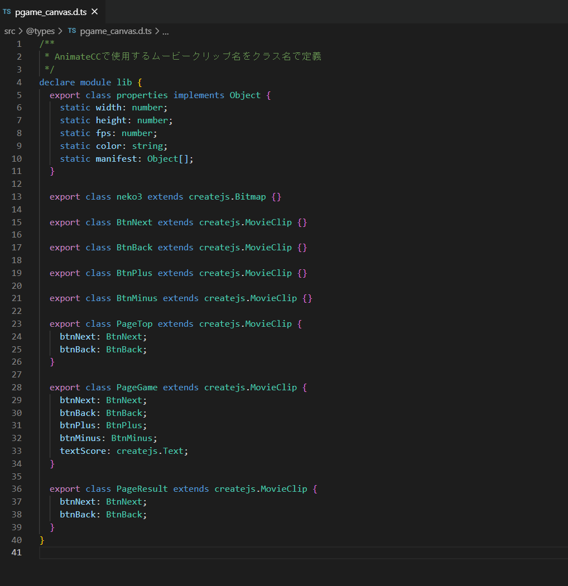
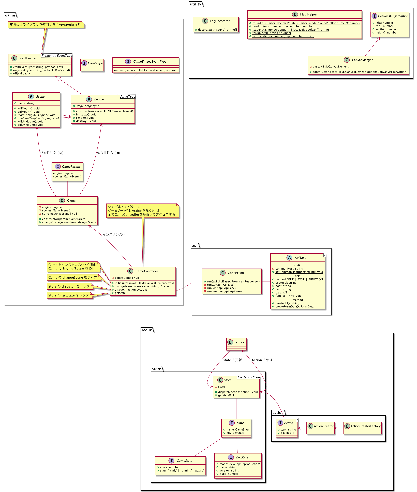

# プチゲーム 作成用フレームワーク

## フレームワークの概要

JavaScript でのプチゲーム開発環境を TypeScript 化

pgame-base-ts 2.0 以降では、プチゲーム開発に使用する JS ライブラリを自由に変更して実装する事が可能  
(デフォルトでは CreateJS が実装済み)

　
## プチゲームの開発準備

### 開発の開始

1. `package.json` の `name`, `version`, `description` を変更する
   - 例 : `"name" : "StopWatch"`, `"version" : "1.0.0"`, `"description" : "ストップウォッチ"`
1. ターミナルでコマンド `$ npm install` を実行 (作業ディレクトリに `node_modules/` フォルダが生成される)

### ローカルでの開発

1. `http://localhost:3000` をブラウザで開く
1. ターミナルでコマンド `$ npm run start` を実行 (開発用のローカルサーバが立ち上がる)
1. pc 版なら「PC」, sp 版なら「SP」をクリック(`pgame_pc.html`, `pgame_sp.html`のいずれかが開かれる)
1. コードを編集して保存したのち、ブラウザをリロードして動作確認

### テストサーバ、本番サーバへのアップ

1. ターミナルでコマンド`$ npm run build:pgame:prod` を実行
1. 作業ディレクトリに`build_prod/` フォルダが生成されるのを確認
1. `build_prod/` フォルダの `jsgame` フォルダを SV1 の自身のゲーム ID のディレクトリに貼り付ける  

　
## フレームワークのガイド
### 主なクラスについて

※各クラスの詳細はコードのコメントを参照

- GameController
  - ゲームを制御する根幹クラス  
    ゲームをロードしたり、エンジンを実装してゲームの初期化を行う  
    またゲーム制御に関わる処理は全て `GameController` を仲介して実行する
- Game
  - シーン、エンジンを DI (依存性注入)されるクラス  
     `changeScene()` メソッドで、シーンのライフサイクルを制御する  
    (「 Scene のライフサイクル」を参照)
- Engine
  - 使用する JS ライブラリを初期化してゲームのエンジンを作成し、canvas に描画するクラス  
    CreateJS 等のエンジンを作成するには、Engine を継承して新しいクラスを作成する
- Scene
  - 全ての Scene の基になるクラス  
    TOP、GAME、RESULT 等の各 Scene は、 `Scene` クラスを継承して作成する
- MathHelper
  - 数値計算を便利にするメソッド

### 主にいじるファイル
デフォルトではCreateJSが実装されており、特にJSライブラリを指定しないならば、  
下記のファイルでゲームの実装ができる。

- `pgame_canvas.d.ts`  
  (ムービークリップの型定義ファイル)


- `top.cj-scene.ts`  
  (TOP画面)


- `game.cj-scene.ts`  
  (GAME画面)


- `result.cj-scene.ts`  
  (RESULT画面)


### pgame_canvas.d.tsについて
AnimateCCでムービークリップを作成してシーンに配置した後、  
```
export class ムービークリップ名 extends createjs.MovieClip {}  
```
という記述でクラスを追加することで、各Sceneから「lib.○○」でムービークリップにアクセスできるようになる  

またAnimateCCで親ムービークリップの上に子ムービークリップを設置してインスタンス名を指定した場合には、  
`pgame_canvas.d.ts` 側で親ムービークリップと子ムービークリップのクラスを追加し、親ムービークリップの {} に  
AnimateCCで指定したインスタンス名と子ムービークリップ名を記入する  
(AnimateCCではボタンを使っていても `pgame_canvas.d.ts` では `createjs.MovieClip` を継承してクラスを生成する)




　
### Scene のライフサイクル

Scene には以下のライフサイクルを実装している

| ライフサイクル | 説明                   |
| -------------- | ---------------------- |
| willMount()    | 画面生成前に実行       |
| didMount()     | 画面生成後に実行       |
| willUnMount()  | 次の画面へ遷移前に実行 |
| didUnMount()   | 次の画面へ遷移後に実行 |

これらのメソッドをオーバライドして使用する  

また各Sceneでこれら全てのメソッドを使用する必要はなく、  
時と場合に応じてメソッドを適宜オーバーライドする  

<使い方の一例>  
willMount() → addChild等の処理を記述

didMount() → ゲーム開始から画面遷移までの一連の処理を記述

willUnMount() → 特に必要なし

didUnMount() → 各値のリセットやremove処理等を記述


### stageのアクセス
各Sceneでstageに呼び出す際は、以下の記述で呼び出す
```
GameController.game?.engine.stage
```


### 結果画面へ値を渡す例

各Sceneではstaticは用いず、以下の手順で結果画面へ値を渡す

1. `game.reducer.ts` の `GameState` 型で、結果画面に渡したい値をオブジェクトに追加して型を定義する  


2. `game.reducer.ts` の `GameReducer` 定数で、代入したオブジェクトの値を初期化する  


3. GAME画面でスコア等が確定した段階で、`gameState.score` のような形で `gameState` オブジェクトの値を更新する


4. GAME画面でRESULT画面に遷移するタイミングで、以下の記述で値を送り、結果画面に遷移させる

```
  GameController.dispatchSync(GameAction.gameStateSet(gameState)).then(() => {  
    GameController.dispatch(GameAction.sceneChange({ sceneName: 'RESULT' }));  
  });
```

4. RESULT画面で以下の記述でGAME画面から送られたオブジェクトを取得する
```
  GameController.getState().game.gameState;
```

※デフォルトでは `GameState` に `{score: number}` が設定されているため、結果画面に渡す値がスコアのみであれば1と2の手順は不要  


### TwitterAPI・LineAPIの呼び出し
結果画面ではTwitterとLineのAPIを呼び出す必要があり、以下の記述を実行する

#### TwitterAPI
コールバック関数で以下の記述を渡し、`gameName`, `gameScore`, `scoreUnit`, `gameUrl`, `gameGenre`の5つの値を指定する   
(各データ型では `gameScore` のみが Number 型であり、それ以外は String 型となる)

```　
  GameController.dispatch(  
    ApiAction.run({  
      api: PgameApi.twitter_share({  
        gameName: (ゲーム名),  
        gameScore: (ゲームスコア),  
        scoreUnit: (スコア単位),  
        gameUrl: (ゲームURL),  
        gameGenre: (ゲームジャンル),  
      }),  
    })  
  );  
```
#### LineAPI
コールバック関数で以下の記述を渡し、`gameUrl` のみ String 型で指定する。 
```
  GameController.dispatch(ApiAction.run({ api: PgameApi.line_share({gameUrl: (ゲームURL)}) }));
```

　
### CreateJS 以外の JS ライブラリを変更・追加する時の手順

CreateJS 以外の JS ライブラリでプチゲーム開発を行うには、 CreateJS の`cj-engine.ts`と同様に、  
`src/game/engines/` ディレクトリー内に使用する JS ライブラリのベースを `〇〇-engine.ts` という形式でクラスを作成する

作成したエンジンを Game クラスに DI (依存性注入) する

　
### クラス相関の概要

pgame-base-ts の全体のクラス構造は以下の通りである

GameController の initialize メソッドを起点に各クラスのメソッドが実行される




### ゲームの状態管理

ゲームのStateは'ready'、'pause'、'running'の3つで管理され、それぞれ準備状態・停止状態・起動状態を表す
( game.reducer.ts の Status 型を参照)

ゲームのStateは以下の記述で取得する
```
  Store.getState().game.status;
```


### フレームワーク改修後のリリース手順

1. CHANGELOG.md に変更点を記載し、新しいリンクも追記する

1. package.json で新しいバージョンを記載する

1. releaseブランチの作成し、buildしてコミットする

1. 新しいバージョン名でreleaseブランチを終了する

1. 新しいバージョン名でタグを作成し、プッシュする

1. Gitの Repository タブの Tag を開き、最新バージョンのタグが表示されるのを確認

1. 鉛筆マークをクリックし、 CHANGELOG.md に記載した変更点を入力して保存する

1. Gitの Project overview タブから Releases を開き、最新バージョンが反映されているのを確認する
